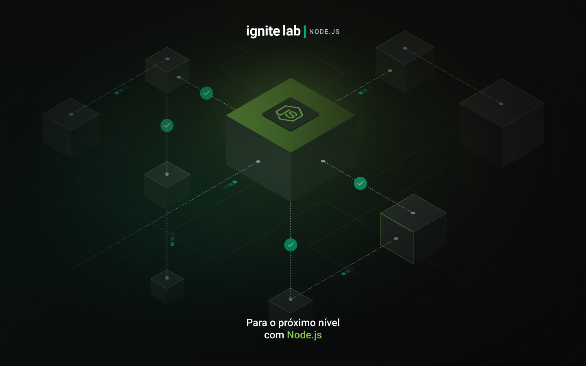

<p align="center">
  <a href="https://app.rocketseat.com.br/event/ignite-lab-04/nodejs/abertura" target="blank"></a>
</p>

[circleci-image]: https://img.shields.io/circleci/build/github/nestjs/nest/master?token=abc123def456
[circleci-url]: https://circleci.com/gh/nestjs/nest

  <p align="center">Um microsserviços de notificações feito em <a href="https://nodejs.org/">Node.js</a> e <a hef="http://nestjs.com">Nest</a></p>
    <p align="center">


## Instalação

```bash
$ npm install
```

## Inicializar a aplicação

```bash
# desenvolvimento
$ npm run start

# modo de visuailização
$ npm run start:dev

# modo de produção
$ npm run start:prod
```

## Testes

```bash
# testes unitatarios
$ npm run test

# testes e2e
$ npm run test:e2e

# testes de cobertura
$ npm run test:cov
```

## ORM 
<p align="center">
  <a href="https://www.prisma.io/" target="blank"></a>
</p>

### Instalação
```bash
$ npm install prisma --save-dev
```

## Banco de Dados
<p align="center">
  <a href="https://www.sqlite.org/index.html" target="blank"></a>
</p>

### Instalação
```bash
$ npx prisma init --datasource-provider sqlite
```


